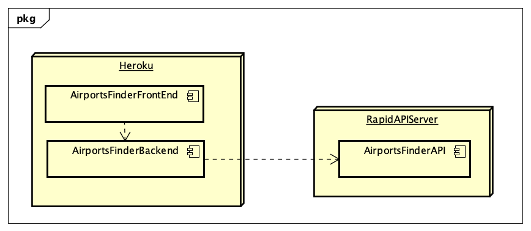

# Escuela Colombiana de Ingeniería Julio Garavito - Arquitecturas de Software ARSW - Parcial Segundo Tercio
## HEROKU LINK 
https://andres-rodriguez-arsw-t2.herokuapp.com/
## Preparación para el Parcial

Con el objetivo de preparar el examen final del segundo tercio, por favor siga las siguientes instrucciones.

1. Explore el API de AiportsFinder en el siguiente [enlace](https://rapidapi.com/cometari/api/airportsfinder/details)
2. Use la colección de Postman adjunta para validar el funcionamiento del endpoint por fuera de la página de RappidAPI.
3. Si no ha terminado por completo el último laboratorio, hagalo, si es necesario desde el inicio y completo. En ese laboratorio esta basado el parcial.
4. Revise la documentación de Google Maps para agregar marcadores a un mapa o revise este [Codepen](https://codepen.io/SitePoint/pen/YWKLzv?editors=0110)

## Descripción del Problema a Solucionar

Su compañía lo ha seleccionado para construir una aplicación que tiene como objetivo consultar los aeropuertos dado el nombre de un lugar como una ciudad por ejemplo.

La aplicación recibirá en un campo el nombre del lugar por el cual el usuario desea buscar aeropuertos, por ejemplo `London` o `Berlin` y deberá mostrar para cada aeropuerto encontrado:

 - Código del aeropuerto
 - Nombre del aeropuerto
 - Nombre de la ciudad donde se encuentra el aeropuerto
 - Código del País donde se encuentra el aeropuerto

Para obtener dicha información utilice el API gratuito de [AirportsFinder](https://rapidapi.com/cometari/api/airportsfinder?endpoint=57ac4d9be4b02b08ce774cc3) el cual usted debió estudiar previamente antes de este examen.

Se le pide que su implementación sea eficiente en cuanto a recursos así que debe implementar un caché que permita evitar hacer consultas repetidas al API externo.

Una vez tenga la funcionalidad básica, extienda su implementación para incluir un mapa en el cual resalte con un indicador la ubicación (latitud y longitud) de todos los aeropuertos encontrados (revise la funcionalidad del API de mapas y el ejemplo anexo.).

Sugerencia realice la implementación de manera incremental. Haga commits regulares.

Ejemplo de la interfaz.


## Requerimientos de Arquitectura

 1. El cliente Web debe ser un cliente asíncrono que use servicios REST desplegados en Heroku y use JSON como formato para los mensajes.
 2. El servidor de Heroku servirá como un gateway para encapsular llamadas a otros servicios Web externos.
 3. La aplicación debe ser multiusuario (Sin registro y sin seguridad )
 4. Todos los protocolos de comunicación serán sobre HTTP.
 5. La interfaz gráfica del cliente debe ser los más limpia y agradable posible y debe utilizar Bootstrap. Para invocar métodos REST desde el cliente usted puede utilizar la tecnología que desee.
 6. La fachada de servicios tendrá un caché que permitirá que llamados que ya se han realizado a las implementaciones concretas con parámetros específicos no se realicen nuevamente. Puede almacenar el llamado como un String con su respectiva respuesta, y comparar el string respectivo. Recuerde que el caché es una simple estructura de datos.
 7. Si el dato del cache tiene más de 5 min se debe solicitar nuevamente al servidor externo.
 8. Se debe poder extender fácilmente, por ejemplo, es fácil agregar nuevas funcionalidades, o es fácil cambiar el proveedor de una funcionalidad.
 9. Debe utilizar maven para gestionar el ciclo de vida, git y GitHub para almacenar al código fuente y Heroku como plataforma de producción.

### Diagrama de Despliegue



### Diagrama de Componentes


## Requerimientos de Entrega

1.  La aplicación funcionando en Heroku con el nombre (NOMBRE-APELLIDO-ARSW-T2) y el código fuente almacenado en un proyecto GitHub con el nombre (NOMBRE-APELLIDO-ARSW-T2).
2.  Los fuentes deben estar documentados y bien estructurados para generar el Javadoc.
3.  El README.md debe describir:
	1. El diseño de arquitectura. 
	2. La forma de ejecutar el programa localmente. 
	3. Explicar cómo se puede extender y cómo podría, por ejemplo, hacer que una función específica la implementara un proveedor de servicios diferente.
	4. Indique la urls de Heroku
4.  Suba el zip del proyecto al aula con el nombre (NOMBRE-APELLIDO-ARSW-T2).
5.  Guarde una copia de su proyecto.

> IMPORTANTE! El parcial que no sea subido a tiempo o que no cumpla al pie de la letra con las condiciones de entrega, será calificado con 0.0 sin lugar a reclamaciones, ya que las condiciones están claras.

## Criterios de Evaluación

1.  Cliente escrito en JS asíncrono invocando servicios REST (10%)
2.  Servidor fachada exponiendo servicios REST (10%)
3.  Conexión a servicios externos (10%)
4.  Cliente Java para Tests concurrentes para el servicio en Heroku y para el del proveedor externo(10%)
5.  Cache tolerante a la concurrencia y una sola instancia para la aplicación (10%)
6.  Implementa la funcionalidad de los mapas de manera asíncrona (15%)
7.  Diseño y descripción del diseño son de alta calidad (30%)
    -   Extensible
    -   Usa patrones
    -   Modular
    -   Organizado
    -   Javadoc publicado
    -   Identifica la función de componentes individuales demuestra conocimiento del funcionamiento general de la arquitectura.

## Ayuda

 - Inicie con la aplicación web basada en spring que le propone Heroku en su guía inicial para java. ([https://devcenter.heroku.com/articles/getting-started-with-java](https://devcenter.heroku.com/articles/getting-started-with-java))
  - Como poner marcadores en un mapa de Google Maps
 [Codepen example](https://codepen.io/SitePoint/pen/YWKLzv?editors=0110)
 - Para invocar un servicios get desde java puede hacerlo de manera fácil con:
```java
import java.io.BufferedReader;
import java.io.IOException;
import java.io.InputStreamReader;
import java.io.OutputStream;
import java.net.HttpURLConnection;
import java.net.URL;

public class HttpConnectionExample {

    private static final String USER_AGENT = "Mozilla/5.0";
    private static final String GET_URL = "https://www.alphavantage.co/query?function=TIME_SERIES_DAILY&symbol=fb&apikey=Q1QZFVJQ21K7C6XM";

    public static void main(String[] args) throws IOException {

        URL obj = new URL(GET_URL);
        HttpURLConnection con = (HttpURLConnection) obj.openConnection();
        con.setRequestMethod("GET");
        con.setRequestProperty("User-Agent", USER_AGENT);
        
        //The following invocation perform the connection implicitly before getting the code
        int responseCode = con.getResponseCode();
        System.out.println("GET Response Code :: " + responseCode);
        
        if (responseCode == HttpURLConnection.HTTP_OK) { // success
            BufferedReader in = new BufferedReader(new InputStreamReader(
                    con.getInputStream()));
            String inputLine;
            StringBuffer response = new StringBuffer();

            while ((inputLine = in.readLine()) != null) {
                response.append(inputLine);
            }
            in.close();

            // print result
            System.out.println(response.toString());
        } else {
            System.out.println("GET request not worked");
        }
        System.out.println("GET DONE");
    }

}
```
 - Parseo de Json
```html
<!DOCTYPE html>
<html>
<body>

<h2>Create Object from JSON String</h2>

<p id="demo"></p>

<script>
var txt = '{"name":"John", "age":30, "city":"New York"}'
var obj = JSON.parse(txt);
document.getElementById("demo").innerHTML = "name: " + obj.name + ", age: " + obj.age;
</script>

</body>
</html>
```
